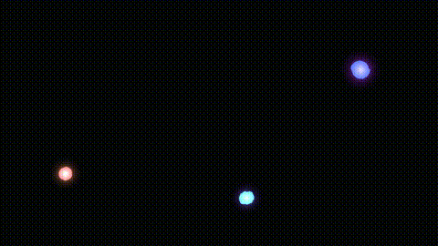

# Singularity Portraits

*A live installation on identity, visibility, and light.*

A camera watches a room. For every face it finds, it reads the underlying
geometry of that face, turns it into a stable identity signature, and renders a
small, self-contained **singularity** — a glowing, moving ball of light that
belongs to that face and no other. The same face always summons the same
singularity; a different face summons a different one. No names, no labels, no
match scores — just light that is unmistakably, persistently *yours*.

See [`singularity-portraits-description.md`](singularity-portraits-description.md)
for the concept and [`singularity-portraits-tech-plan.md`](singularity-portraits-tech-plan.md)
for the technical plan this implements. Autonomous choices made during the build
are logged in [`decisions.md`](decisions.md).

---

## What's here (Phase 1)

A complete, modular pipeline:

```
frame source -> detector (face -> embedding) -> identity registry
             -> seed -> visual params -> tracking -> render
```

Each stage is its own module and ignorant of the others, so going from one face
(Phase 1) to a roomful (Phase 2) is a scaling exercise, not a rewrite — the loop
already handles "for each face in the frame."

| Stage | Module |
|-------|--------|
| Frame sources (webcam / video / images / synthetic) | `singularity/sources.py` |
| Detection + embedding (real + synthetic backends) | `singularity/identity/detector.py` |
| Identity resolution + persistence | `singularity/identity/registry.py` |
| Embedding → deterministic visual fingerprint | `singularity/visuals/seed.py` |
| Rendering (additive glow, trails, headless-capable) | `singularity/visuals/render.py` |
| Motion smoothing + per-identity lifecycle | `singularity/visuals/tracking.py` |
| Orchestration loop | `singularity/app.py`, `main.py` |

### Preview the output without a camera

These two artifacts are committed so you can see what it does at a glance:

- **`assets/gallery.png`** — twelve distinct identities, one singularity each.
- **`assets/walkthrough.mp4`** — three synthetic people moving through a room,
  each trailing their own light.




---

## Setup

### Camera-free / synthetic path (pip, works anywhere)

```bash
python -m venv venv
source venv/bin/activate
pip install -r requirements.txt
```

### Live webcam path (conda, recommended on macOS)

`dlib` ships C++ code that fails to compile on modern macOS (missing `fp.h` in
recent Xcode SDKs). The easiest fix is conda, which provides a prebuilt binary:

```bash
conda create -n singularity python=3.12 -y
conda activate singularity
conda install -c conda-forge dlib -y
pip install face_recognition pygame "opencv-python-headless<4.11" "numpy<2"
```

> **numpy < 2 is required.** The conda-forge `dlib` build is linked against
> numpy 1.x; numpy 2.x changes the array ABI and causes `RuntimeError:
> Unsupported image type` at detection time.

If you don't have conda, install [miniforge](https://github.com/conda-forge/miniforge)
(lightweight conda for Apple Silicon / Linux):

```bash
curl -fsSL -o /tmp/miniforge.sh \
  https://github.com/conda-forge/miniforge/releases/latest/download/Miniforge3-$(uname)-$(uname -m).sh
bash /tmp/miniforge.sh -b -p ~/miniforge3
eval "$(~/miniforge3/bin/conda shell.$(basename $SHELL) hook)"
```

On macOS you will also need to grant **camera access** to your terminal app the
first time you run the webcam source (System Settings > Privacy & Security >
Camera).

---

## Running it

**Camera-free demo (works anywhere, no camera or display needed):**

```bash
# Render a contact sheet of distinct singularities
python tools/gallery.py --count 12 --out assets/gallery.png

# Record a moving multi-face walkthrough to MP4
python main.py --source synthetic --headless --record assets/walkthrough.mp4 \
    --max-frames 240 --width 960 --height 540
```

**The real thing (Phase 1 proof of concept — needs a webcam + `face_recognition`):**

```bash
python main.py --source webcam            # one face in, one singularity out
```

Other sources:

```bash
python main.py --source video  --video clip.mp4 --loop
python main.py --source images --images-dir ./faces
```

Useful flags: `--headless` (no window), `--record out.mp4`, `--max-frames N`,
`--threshold 0.6` (identity match distance), `--personas 3` (synthetic only),
`--fr-model {hog,cnn}`. Run `python main.py --help` for the full list.

### Persistence & a note on biometric data

By default the identity registry lives **in memory only** and is gone when the
process exits. Passing `--registry path.json` makes the installation *remember
faces across runs* — which means writing biometric embeddings to disk. That is a
deliberate, ethically loaded choice for a piece about surveillance, so it is
opt-in rather than the default. Decide it on purpose.

---

## Tests

The correctness-critical, deterministic half of the pipeline — "same face → same
singularity", "different faces → different identities", persistence, tracking —
is covered and runs with no camera and no display:

```bash
pip install -r requirements-dev.txt
python -m pytest
```

---

## Status

Phase 1 is implemented and validated on both the synthetic path and the live
webcam path (tested on macOS with Apple Silicon via conda-installed dlib). Phase
2 (multiple real faces, wide/overhead camera, possibly InsightFace embeddings)
is architected for but not built; see the tech plan and `decisions.md`.
